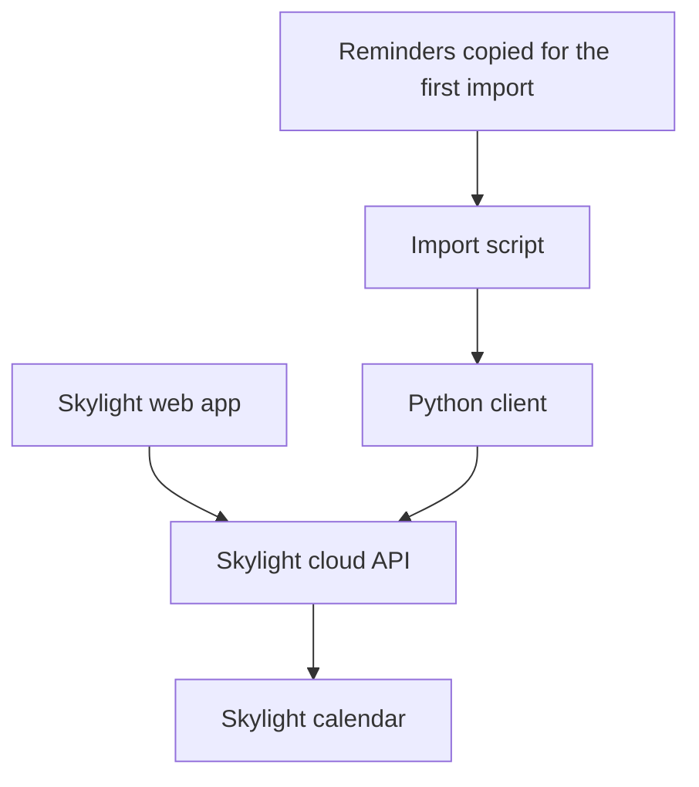
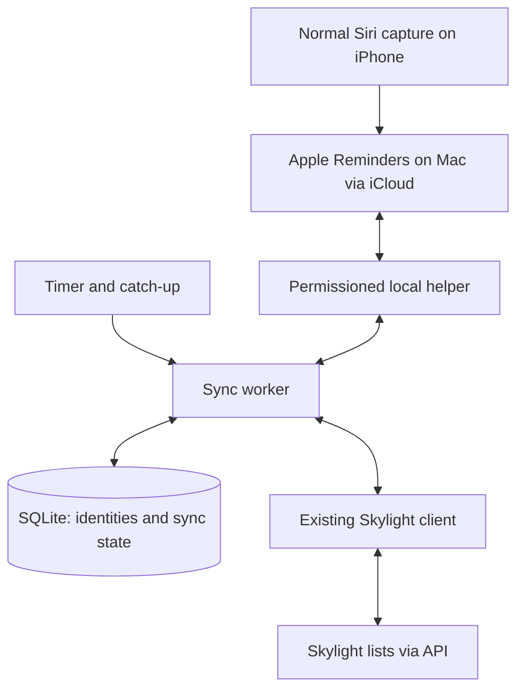

i like my skylight.

if you haven't seen one, [skylight is a touchscreen calendar for your home](https://shop.myskylight.com/). it brings everyone's calendars onto one screen, with colors for different people, plus chores, to-dos, and shared lists.

all the little things involved in running a household, somewhere everyone can see them. you walk past it. there's your day.

my favorite part is the lists.

i like lists. i like checking things off. every check is a little dopamine hit.

did the thing. checked the box. wonderful. give me another one.

so having my lists on that screen, ready to check off? yes. that's what i wanted.

my reminders live in apple reminders. adding one is easy.

i hold the power button on my phone, siri comes up, and i go “remind me to check the laundry in 30 minutes.”

done. that's the whole interaction.

i'd like those reminders on the skylight too, without giving myself a recurring task called “update the other task list.”

very productive. excellent system.

so i started poking around.

when you add a chore or a calendar event, the app sends a request somewhere. i wanted to see what it was sending, then make those requests myself.

[dax had posted about this](https://x.com/thdxr/status/2078727284865827140), crediting james long: record the browser's network requests, then build a client from them. he'd done it for uber eats.

i had a calendar to deal with.

<Tweet id="2078727284865827140" />

i also pulled in matt van horn's [printing press](https://github.com/mvanhorn/cli-printing-press) as a reference for the approach.


first, find the device on my network. see what we could reach.

the device's traffic was encrypted. the web app gave us a much easier place to look.

its javascript bundle contained the API paths and the shapes of the requests. we used that to work out how lists, calendar events, and chores were represented, then tested requests against my account.

so the path became:



the calendar already knew how to display its cloud data. we needed a way to put my data there.

the client ended up being small. python, standard library, methods for the operations i needed. here's the list-item method from the working code:

```python
def add_item(self, list_id, label, category_id=None, section=None):
    body = {"label": label, "category_id": category_id, "section": section}
    return self._req("POST", self.f(f"lists/{list_id}/list_items"), body)
```

`self.f()` scopes the path to my skylight device. `_req()` handles the request and authentication. the import script can call `add_item()` without knowing any of that.

that separation is useful later. a scheduled job, a little web page, or another script can use the same client.

authentication needed some attention too. this is the refresh branch in the client:

```python
status, payload = self._raw(method, path, body)
if status == 401 and self.refresh:
    if self._do_refresh():
        status, payload = self._raw(method, path, body)
```

one refresh attempt, then try the request again. if it still fails, the current script exits with an error.

before importing my reminders, we tested the round trips: create a list item, mark it complete, delete it. create calendar events, delete those too. check that token refresh works.

then the import.

33 reminders copied into skylight's to-do list. we saved the returned IDs and read the list back through the API to verify they were there. the originals stayed in apple reminders.

good. the first trip worked.

i put a [cleaned copy of the client on github](https://github.com/kevinmanase/skylight-calendar-client). credentials and personal reminder data are excluded. it's an unofficial educational project; the repo includes [its limits and disclaimers](https://github.com/kevinmanase/skylight-calendar-client/blob/main/DISCLAIMER.md).

the public version uses its own User-Agent and has 22 offline tests. i haven't tested that version against skylight. the live results above came from the original experiment.

now i want to stop being involved in the second one.

**the automatic version is the next build.** what exists today is the client and a successful one-time import.

could this just be an ifttt thing? or an apple shortcut?

maybe. i looked at both.

[ifttt has triggers for new and completed apple reminders](https://ifttt.com/ios_reminders). those could call a small bridge to our client. but [ifttt says its iphone background syncing can be unreliable](https://help.ifttt.com/hc/en-us/articles/115010193327-About-iOS-background-syncing). if i have to remember to open another app so my reminders remember to sync, we've taken a wrong turn.

shortcuts can [read reminders](https://support.apple.com/guide/shortcuts/apd3c845e881/ios) and [make API requests](https://support.apple.com/guide/shortcuts/apd58d46713f/ios). a “sync skylight” button seems doable. scheduled runs too. but i couldn't find a generic “a reminder was added” trigger in [apple's automation docs](https://support.apple.com/guide/shortcuts/add-automations-apdfbdbd7123/ios). running when i close reminders misses the point: i use siri. i might never open the app.

a custom siri shortcut could write to both places. then i'd have to remember a different phrase, and it would only cover reminders added that way.

i already like how adding a reminder works.

so the rough version i'd actually build is a small helper on my mac. [icloud already brings my reminders there](https://support.apple.com/guide/icloud/mmc591432bd9/icloud). give the helper permission to read and update them. start with one selected list, nonrecurring reminders only, and include completed items when reading so those changes make it across too. run it manually first, then check periodically while the mac is awake and catch up when it resumes.



apple reminders would own the wording. checking something off would travel both ways. if i check it off on the wall and the next sync unchecks it, what are we even doing here.

reopening a completed task would pause that pair for review in the first version. i don't want a guess about which edit was newer quietly undoing something.

due dates and alerts would stay in apple reminders. our current skylight list-item method doesn't have a due-date field. the phone can still remind me about the laundry in 30 minutes; getting the task onto the wall doesn't move that alert.

the worker needs to remember what it has already copied. a task's title is a terrible identity. i can rename “buy milk.” i can also need milk twice.

so i'd keep a mapping like this. this is proposed storage, not part of the first importer:

```sql
CREATE TABLE reminder_links (
    reminder_id TEXT PRIMARY KEY,
    skylight_id TEXT UNIQUE,
    confirmed_hash TEXT,
    apple_completed INTEGER NOT NULL,
    skylight_completed INTEGER NOT NULL
);
```

the reminder ID identifies the source item. the skylight ID identifies its copy. the hash records the source fields last confirmed there. the two completion values record what we last confirmed on each side, so the next pass can spot a change. this is a sketch; pending operations need their own storage too.

i'd keep the source account and list context too. [apple's local IDs can change during a full resync](https://developer.apple.com/documentation/eventkit/ekcalendaritem/calendaritemidentifier). an identity i can't resolve gets flagged before anything new is created.

the existing 33 copies need pairing with their source reminders first. we have their skylight IDs. i don't want the first automatic run celebrating with 33 duplicates.

new item: create it and save the mapping. checked off: reconcile the matching item. unchanged: leave it alone. title changes would get flagged until i've verified the API's rename behavior; the existing client already supports changing completion status.

then there's the annoying bit.

what if skylight creates the item, but the request times out before i get the ID back? or the process crashes after getting the ID, before saving it locally?

“retry” could give me two milks.

i'd record each pending write before sending it. a create with an unknown result stays unresolved until i can identify what happened. if the API supports a caller-supplied unique key, i'd use it. i haven't verified that support. without it, ambiguous creates need reconciliation or a small nudge from me before another attempt.

the rest is a few rules:

- one run at a time. no overlapping imports.
- a failed or incomplete reminders read changes nothing on skylight.
- skylight reads need to include completed items and every page too. incomplete reads stop the run.
- missing items on either side get flagged, not automatically deleted or recreated.
- compare skylight with reminders periodically, even when reminders haven't changed. that catches edits made on the calendar too.
- back off on transient failures. surface expired access or a changed API instead of retrying forever.

i'd also change the client's exit-on-error behavior so the worker can distinguish a failed login from a temporary network problem.

this is still an unofficial API. keeping its details inside one client gives me one place to fix things if skylight changes them.

the mac has to be awake for this version to run. that's fine for a first pass. if the delay bothers me, i'd move the worker to a mac that stays on.

the useful status screen would be very boring: last successful sync, how many changes are waiting, anything that needs me.

i put the [options, tradeoffs, and rough build plan in the repo](https://github.com/kevinmanase/skylight-calendar-client/blob/main/ARCHITECTURE.md). none of that sync worker exists yet. first proof: add one reminder, run twice without making a duplicate, check it off on the wall, and see that check reach my phone.

eventually, i want to tell siri to remind me about something and walk past it on the calendar.

that's the feature.
