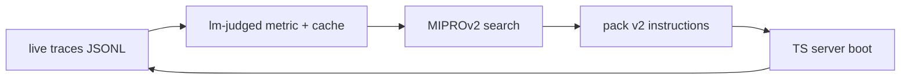

people on twitter have figured out the dark art of prompt engineering, and it's beautiful.

<Tweet id="2046279421850767462" />

<Tweet id="2045402866521641354" />

incantations. that's what these are. you stack the right magic words and the model snaps to attention. "make no mistake." "be thorough." "do not hallucinate." "this is critical." the prompt is half technical instruction, half ritual.

it's funny because it's true. and it's a little funnier because we're all doing it. i write `do not invent quotes` in my system prompts. you write `respond in a friendly tone`. somewhere a YC founder is writing `act as a 10x engineer` into a config file and shipping it to production.

hope-and-pray prompt engineering is the dominant ML methodology of 2026. it kind of works. enough that a billion-dollar industry runs on it. don't ask me whether it scales.

so. what if we stopped praying.

that's what this post is about. i picked one prompt in my multi-agent app, the one all the personas argue through, and i stopped guessing at it. i compiled it. against a metric. on real traces. on a forty-minute budget. for zero marginal cost on top of the chatgpt subscription i was already paying for.

the receipts are below.

## the problem

i'm building a multi-agent deliberation app called Gossip. internally i call it "the room." six rhetorical-move personas argue toward decisions. the core call is `speak`: given the room state, the persona, and the prior turns, the model produces an utterance and tags one `rhetorical_move` (reframe, steelman, probe, dissent-on-evidence, synthesize, verify).

the system prompt for `speak` is the bottleneck of the entire app. every personality lives in it. every guardrail. every anti-fabrication clause. when that prompt is wrong, every agent is wrong.

hand-tuned prompts have a ceiling, and you can feel that ceiling in your shoulders. you change a word, you swap an example, you rerun a thread, you squint at the diff. the only honest answer to "did that help?" is "i don't know."

the system grows by vibes. vibes do not compound.

## the why-now signal

i instrumented every `speak` call to a JSONL trace. inputs, output, persona, room state, timestamp. nothing fancy. then i waited.

at 48 threads, 400+ clean speak turns, and 3 distinct workspaces of real conversation, the gate was met. that is the dataset DSPy needs. real traffic, real arguments, real disagreements. not a synthetic eval set you wrote in a notebook.

if you do this earlier, you are optimizing against fiction.

## the metric

DSPy needs a score. one number per (input, output) pair, in 0..1.

i landed on six dimensions. four are LM-judged, two are derived from the trace itself.

| dimension                       | type      | what it scores                                         |
|--------------------------------|-----------|--------------------------------------------------------|
| verified_claim_ratio           | LM-judged | claims that ground out vs claims pulled from the air   |
| fake_consensus_penalty         | LM-judged | "we all agree" said before anyone agreed               |
| ship_artifact_quality          | LM-judged | utterance pushes toward a decision, not vibes          |
| intent_mode_fit                | LM-judged | speech matches the room's current mode                 |
| rhetorical-move repetition     | trace     | penalty when the same agent reuses the same move       |
| speaker diversity              | trace     | reward when the floor moves around                     |

aggregate by weighted mean.

the judge is claude haiku 4.5, cached on disk by SHA of the judge prompt. re-runs are free. you do not want to pay for the same judgment twice when the optimizer is exploring 100 candidates.

## the billing unlock

if you wire DSPy straight to the metered Anthropic or OpenAI API, MIPROv2 will burn hundreds of dollars on judge calls during a real run. the math is brutal: roughly 25 trials, 10 candidates, 120 val examples, multiple judge calls per example. it adds up fast.

i already pay for a chatgpt subscription, which includes OpenAI Codex. any coding harness compatible with an OpenAI Codex subscription can route through it without metered api fees on top. pi is the harness i happen to use, because it is the most customizable for what i need. codex cli is another. there are others. the harness is interchangeable. the unlock is the OpenAI Codex subscription bundled with chatgpt.

so i routed every optimizer LM call through an internal `/api/internal/judge` endpoint on the local TS server. that endpoint hands the call to pi-ai, which uses my chatgpt subscription. the optimizer never touches a metered api.

the bridge is a `dspy.LM` subclass that talks HTTP to the local server.

```python
# tools/dspy-optimizer/pi_bridge.py
import copy, httpx, dspy

class PiBridgeLM(dspy.LM):
    def __init__(self, endpoint: str, model: str, **kwargs):
        super().__init__(model=model, **kwargs)
        self.endpoint = endpoint
        self._client = httpx.Client(timeout=120.0)

    def basic_request(self, prompt: str, **kw):
        r = self._client.post(self.endpoint, json={"prompt": prompt, "model": self.model, **kw})
        r.raise_for_status()
        return r.json()["completion"]

    # MIPROv2's GroundedProposer deepcopies the LM. httpx.Client holds an
    # RLock that does not pickle. give it a clean copy without the client.
    def __deepcopy__(self, memo):
        clone = self.__class__.__new__(self.__class__)
        clone.__dict__.update({k: v for k, v in self.__dict__.items() if k != "_client"})
        clone._client = httpx.Client(timeout=120.0)
        return clone

    def __getstate__(self):
        s = self.__dict__.copy()
        s.pop("_client", None)
        return s

    def __setstate__(self, s):
        self.__dict__.update(s)
        self._client = httpx.Client(timeout=120.0)
```

without that deepcopy/getstate/setstate dance, MIPROv2 crashes the moment its proposer tries to clone the LM. it took a smoke run to surface. now it is a one-liner you copy.

## the metric closure

DSPy expects `metric(example, prediction, trace=None) -> float`. a closure is the cleanest way to inject the judge LM and the cache.

```python
# tools/dspy-optimizer/metric.py
def make_metric_fn(judge_lm, cache, weights):
    def metric(example, pred, trace=None):
        scores = {
            "verified_claim_ratio":   judge(judge_lm, cache, "verified", example, pred),
            "fake_consensus_penalty": 1 - judge(judge_lm, cache, "fake_consensus", example, pred),
            "ship_artifact_quality":  judge(judge_lm, cache, "ship", example, pred),
            "intent_mode_fit":        judge(judge_lm, cache, "intent_fit", example, pred),
            "move_repetition":        1 - move_repeat_penalty(example, pred),
            "speaker_diversity":      speaker_diversity_score(example, pred),
        }
        return sum(weights[k] * scores[k] for k in scores)
    return metric
```

every `judge(...)` call hits the on-disk cache first. a miss is one HTTP request to the bridge. a hit is a dict lookup. the optimizer can rerun the same eval set across trials and the cost stays flat.

## miprov2

bayesian search over candidate instruction strings. the optimizer proposes, scores, and picks.

the contract is what makes it tractable. `SpeakSignature` in Python mirrors the TS `Signature` exactly: 12 input fields, 2 outputs. one source of truth, two languages.

```python
# tools/dspy-optimizer/signatures.py
class SpeakSignature(dspy.Signature):
    """Produce one utterance and tag a rhetorical_move."""
    room_state: str = dspy.InputField()
    persona: str = dspy.InputField()
    prior_turns: str = dspy.InputField()
    # ... 9 more input fields ...
    utterance: str = dspy.OutputField()
    rhetorical_move: str = dspy.OutputField()
```

`SpeakProgram` seeds `signature.instructions` with the production default. that means the search lower bound is the prompt running today. you cannot regress. worst case, the optimizer picks the seed and you ship what you already had.

the output is a v2 instruction pack (JSON) the TS server reads at boot.

```
packages/server/src/dspy/signatures/speak.ts   # signature + loader
packages/server/src/server.ts                  # boot reads pack v2
tools/dspy-optimizer/optimize.py               # the runner
tools/dspy-optimizer/packs/speak.v2.json       # the artifact
```

## smoke runs first

never start with the real budget. you will lose hours to a typo.

i ran tiny first: 8 train examples, 2 candidates, 3 trials. the smoke run surfaced four bugs.

- `optuna` was not installed. MIPROv2 needs it. fix.
- the deepcopy crash on the LM, captured in the bridge above.
- minibatching defaulted on a tiny valset and produced garbage scores. forced full eval for smoke.
- a v1-vs-v2 pack format mistake. i had been writing the optimized signature into every persona's `voice` field. architecturally wrong. MIPRO optimizes the signature's instructions, not per-persona voice. that is a separate optimization. the pack format split into v1 (per-persona voice) and v2 (signature instructions). only v2 ran this round.

every one of those would have been a real-run killer.

## the real run

after smoke went green:

- 80 train examples
- 40 val examples
- 10 candidates
- 25 trials
- judge: claude haiku 4.5
- speak LM: gpt-5.5, via pi, via my chatgpt subscription
- wall clock: 40 minutes
- cost: zero marginal spend on top of the existing chatgpt subscription

| run                                       | full-eval score |
|------------------------------------------|-----------------|
| baseline (production speak prompt today) | 79.4            |
| best optimized candidate                 | 80.1            |

the +0.7 was found on the very last trial.

i am not going to oversell that number. on this metric, on this val set, it is a real signal but a small one.

the qualitative diff is where the real signal is. the optimizer pulled in:

| structural element            | baseline | optimized |
|-------------------------------|----------|-----------|
| numbered output spec          | no       | yes       |
| per-move semantic definitions | partial  | yes       |
| anti-fabrication clause       | implicit | explicit  |
| persona-role anchoring        | weak     | strong    |
| concrete in-prompt examples   | no       | yes       |
| closing constraint            | no       | yes       |

the optimizer did not invent a new tone. it tightened a sloppy one. it noticed that the model behaved better with numbered fields and stronger persona anchors. it noticed that "be honest" works worse than "do not invent quotes; if uncertain, mark verify." it noticed things i would have eventually noticed.

it noticed them in 40 minutes, against a metric, on real traces.

## the loop



that is the whole point.

every prompt in the system is now a thing that can be improved by data instead of by vibes. live traffic generates traces. traces feed the metric. the metric feeds the optimizer. the optimizer writes a pack. the server boots with the pack. the next batch of traces measures whether the lift was real.

before this, prompts moved when i moved them. now prompts move when the data moves.

## why the subscription mattered

a sidebar, but a load-bearing one.

if i had wired this to a metered API directly:

- one real run: roughly $200 to $400 in judge calls, conservatively.
- i would have run it once, maybe twice, carefully.
- every smoke bug above would have been a real-money bug.
- i would not have explored 10 candidates. i would have explored 3.

routed through my chatgpt subscription via pi:

- one real run: no marginal spend on top of the existing subscription.
- i ran ten variants of the metric weighting, the train/val split, and the candidate count.
- smoke runs cost nothing extra, so i ran a lot of them, and the bugs surfaced fast.
- exploration is the real unlock. subscription access is exploration insurance.

the lesson generalizes. if you are going to optimize prompts at scale, do not optimize against metered APIs. find a coding harness that routes through a subscription you already pay for, and put everything behind it. the cost model changes the engineering posture more than any framework choice.

## what's next

- v3 packs: per-persona voice optimization. run MIPRO once per persona against a persona-specific subset of traces. this is the v1 pack format from earlier, done correctly.
- bootstrapped few-shot demos. MIPRO already produces them and they ride along in the pack. the TS server does not read them yet. wire that up.
- A/B the optimized pack on real threads against the baseline. measure the metric on fresh data, not the val set the optimizer trained on. that is the actual proof.
- once the loop hums, every signature in the codebase gets the same treatment. monitor. refine. decide. all of them.

## the takeaway

the +0.7 is not the win.

the closed loop is the win. traces in, optimized prompts out, fresh traces measure the lift.

stop hand-tuning prompts.

let the traces do it.
